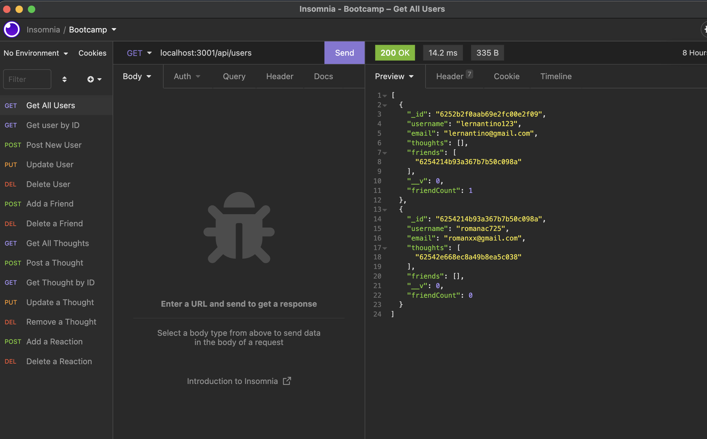
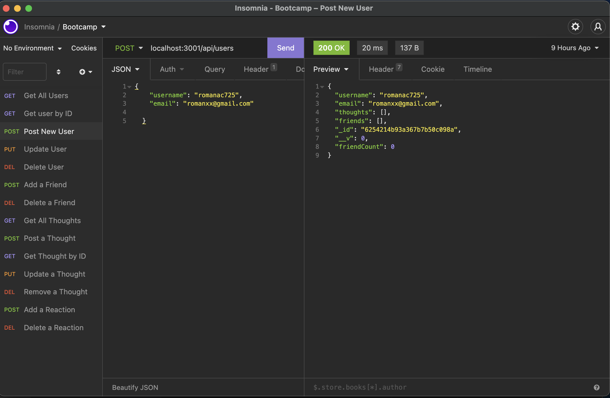
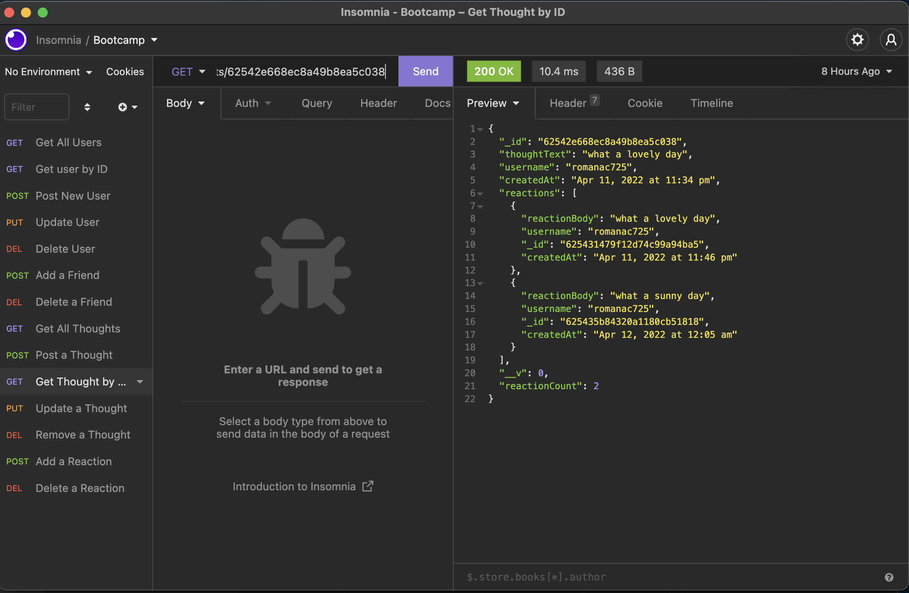

# Siocial-Network-API

## Table of Contents
  * [User Story](#user-story)
  * [Mission](#mission)
  * [GITHUB page](#github-page)
  * [Demo Link](#demo-link)
  * [Screenshots](#screenshots)
  * [Contributors](#contributors)

## User Story

    As a member of cummunity/society i would like to build an web applicaiton where users can post the help they need with a particular task and display under their profile. simultaneously, An user can also search and browse task by other users and offer help as a volunteer.
    

## Mission
    * to build an web application that allows users who need help to post their task and also view and accept tasks posted by other users
    * a task location is to attached to the task so the volunteer can calculate the distance in between
    * have a clean, polished and responsive user interface

## GITHUB page

[Github](https://github.com/roman-ac/social-network-api-by-roman-ac)

## Demo Link

chrome-extension://

# Screenshots

  
  

  
  

  
  

## Contributors
  ### Reach out here: 
  [roman-ac](https://github.com/roman-ac)